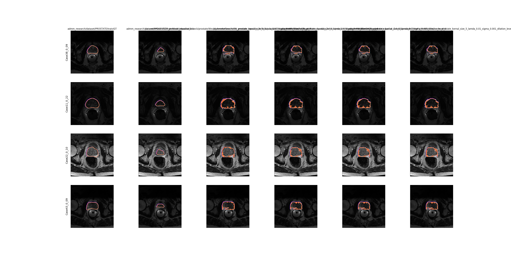
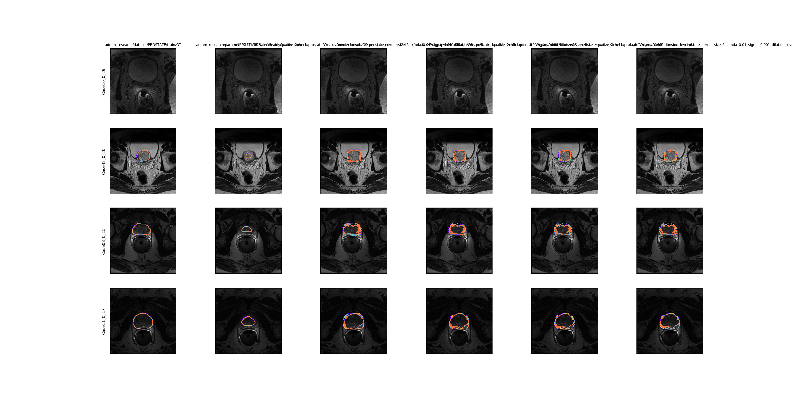
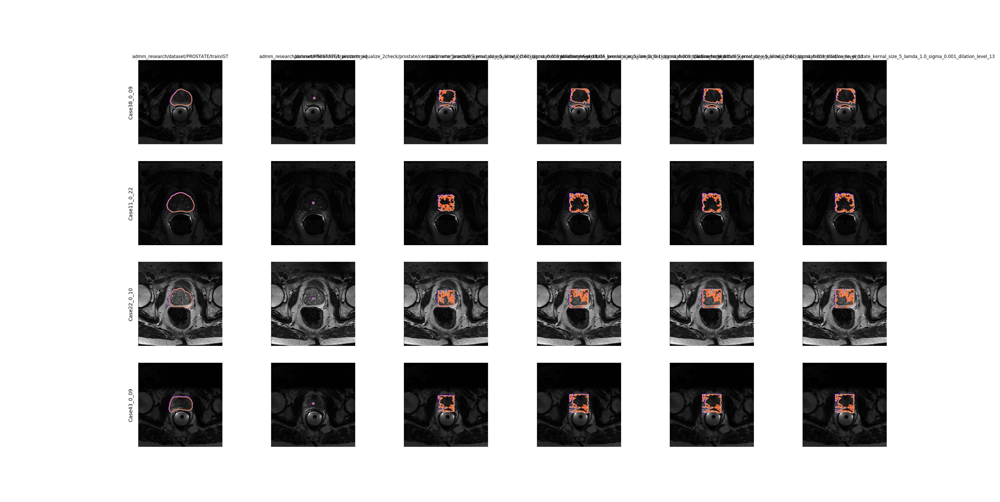
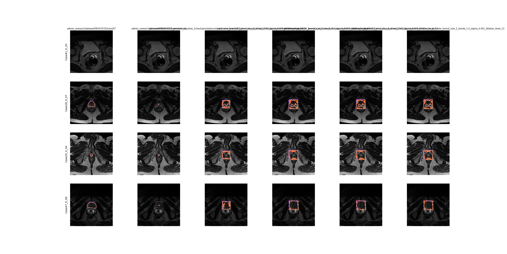

### Parameter Search results:

The parameter Search consists of finding the best configuration of graphcut and other related 
parameters, given the forground seeds and the input pictures.

The performance of each parameter is evaluated by DSC index and we choose the best case for the following ADMM training. 

### The parameters include:
- kernel_size: for the graphcut receptive field where it imposes the local smoothness. 
- lambda: balance weight between unary term and pairwise term.
- sigma: the normalized term for intensity difference, using `exp(1/sigma |intensity difference|^2)`
- dilation_level: dilation index for dilate the forground seed in order to enlarge the foreground seed.

### Best case for the ACDC Dataset:

<table>
 <tr>
  <td>kernal_size</td>
  <td>lamda</td>
  <td>sigma</td>
  <td>dilation_level</td>
  <td>fd</td>
 </tr>
 <tr>
  <td>7</td>
  <td>0.1</td>
  <td>0.001</td>
  <td>7</td>
  <td>0.811376206</td>
 </tr>
 <tr>
</table>

## Best case for the Prostate Dataset:
- WeaklyAnnotations

<table>
 <tr>
  <td>kernal_size</td>
  <td>lamda</td>
  <td>sigma</td>
  <td>dilation_level</td>
  <td>fd</td>
 </tr>
 <tr>
  <td>5</td>
  <td>0.01</td>
  <td>0.001</td>
  <td>6</td>
  <td>0.891715854</td>
 </tr>
 <tr>
</table>

- Centroid
<table>
 <tr>
  <td>kernal_size</td>
  <td>lamda</td>
  <td>sigma</td>
  <td>dilation_level</td>
  <td>fd</td>
 </tr>
 <tr>
  <td>5</td>
  <td>0.01</td>
  <td>100</td>
  <td>5</td>
  <td>0.821180217</td>
 </tr>
</table>

